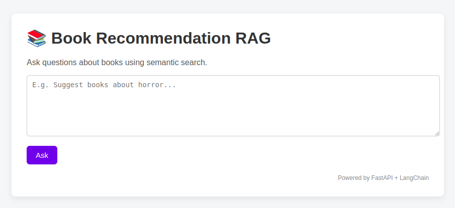

### 📚 Book Recommendation Agent with RAG

An intelligent book recommendation system powered by Retrieval-Augmented Generation (RAG) and LLMs. This system provides personalized book suggestions by combining vector search with generative AI, offering detailed recommendations based on actual book data.

#### ✨ Features

🔍 **Intelligent Search**: Semantic search across book titles, authors, and metadata using vector embeddings

🤖 **AI-Powered Recommendations**: LLM-generated personalized recommendations with reasoning

📊 **Data-Driven**: Based on real book ratings, genres, and descriptions

⚡ **Fast & Scalable**: Built with FastAPI and optimized vector databases

🐳 **Docker Ready**: Containerized for easy deployment (In progress)

#### 🚀 Quick Start

Prerequisites:

**Virtual env**

 - python3 -m venv .venv
 - source .venv/bin/activate
 - pip install --upgrade pip
 - pip install -r requirements.txt

 To execute the book recommender api:

 - uvicorn app:app --reload

**Dataset**

 - zygmunt/goodbooks-10k from kaggle stored data/books.csv 

**API Key**

 - You should cread an .env and store your Google Gemini API Key as `GEMINI_API_KEY`

**Python**

 - 3.9+

System interface

