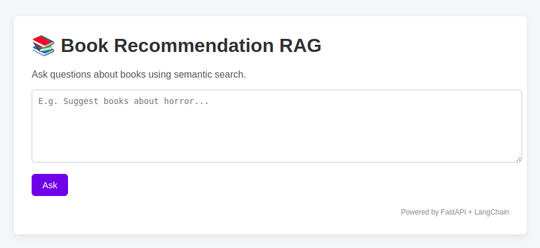

### 📚 Book Recommendation Agent with RAG

An intelligent book recommendation system powered by Retrieval-Augmented Generation (RAG) and LLMs. This system provides personalized book suggestions by combining vector search with generative AI, offering detailed recommendations based on actual book data.

#### ✨ Features

🔍 **Intelligent Search**: Semantic search across book titles, authors, and metadata using vector embeddings

🤖 **AI-Powered Recommendations**: LLM-generated personalized recommendations with reasoning

📊 **Data-Driven**: Based on real book ratings, genres, and descriptions

⚡ **Fast & Scalable**: Built with FastAPI and optimized vector databases

🐳 **Docker Ready**: Containerized for easy deployment (see Docker section)

#### 🚀 Quick Start (Local development)

Prerequisites:

- Python 3.9+
- (Optional) A virtual environment

Local dev steps:

- python3 -m venv .venv
- source .venv/bin/activate
- pip install --upgrade pip
- pip install -r requirements.txt

Run the API locally:

- uvicorn app:app --reload

#### Environment

Create a `.env` file in project root and provide your sensitive keys. At minimum set:

- GEMINI_API_KEY=<your_google_gemini_api_key>

The project reads environment variables from `.env` when using Docker Compose.

#### Docker (recommended for deployment)

The repository includes a `Dockerfile` and `docker-compose.yml` to build and run the service.

Build and run with Docker Compose (recommended):

- docker compose up --build -d
- docker compose logs web
- docker compose down 
- web browser: http://localhost:8000/

Build and run the image manually:

- docker build -t book-recommender:latest .
- docker run --env-file .env -p 8000:8000 -v "$(pwd)/data:/app/data" -v "$(pwd)/vdb:/app/vdb" --rm book-recommender:latest

Notes:

- The Compose file maps host port `8000` to container port `8000`.
- Volumes: `./data` and `./vdb` are mounted into `/app/data` and `/app/vdb` so the vectorstore and dataset persist outside the container.
- A healthcheck is configured for the service and probes the root endpoint.
- Use `.dockerignore` to keep large or sensitive files out of the image (the repo includes one).

#### Dataset

- zygmunt/goodbooks-10k from Kaggle — cleaned and stored at `data/books.csv`

#### API Key

- Store your Google Gemini API Key in `.env` as `GEMINI_API_KEY`.

